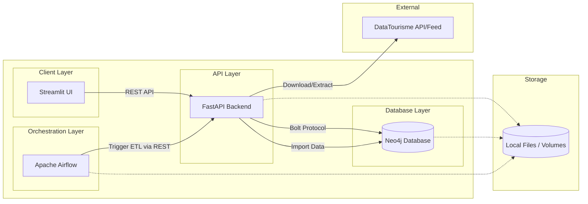

______________________________________________________________________

This project provides a web-based system for planning optimized holiday itineraries
across France. It tackles the challenge of efficiently managing and querying large
datasets containing cities, road connections, and diverse Points of Interest (POIs)
such as restaurants, hotels, and tourist attractions.

The backend is powered by a **Neo4j Graph Database**, which models spatial and relational
travel data. Route optimization is handled using classic algorithms like **Dijkstra**
and the **Traveling Salesman Problem (TSP)**, exposed through a **FastAPI** service.
By combining tourism datasets with a simulated road network, the system enables
intelligent route planning and structured itinerary generation for travelers exploring
France.

## Motivation

The idea behind this project originated from a common interest in applying modern
database technologies to practical solutions in the tourism sector. The goal was
to develop a system that can not only efficiently manage large amounts of geographic
and tourism-related data, but also use this data intelligently to solve real-world
travel planning problems.

By combining graph databases, routing algorithms, and a modern web interface, this
project demonstrates how complex data structures can be transformed into meaningful
and useful tools for end users. At the same time, it serves as a practical showcase
for the use of Neo4j, FastAPI, and algorithmic route optimization in a realistic
application scenario.

## Dependencies

- **[Python](https://www.python.org/)** (`>=3.13.0,<3.14`)\
  Core runtime used across the project.
- **[Loguru](https://loguru.readthedocs.io/)** (`0.7.3`)\
  Shared logging framework used by both frontend and backend.
- **[Neo4j](https://neo4j.com/)** (`5.x`)\
  Graph database used for storing cities, POIs, and routing data.
- **[Docker](https://www.docker.com/)**\
  Container runtime used to run services consistently across environments.
- **[Docker Compose](https://docs.docker.com/compose/)**\
  Tooling to orchestrate multi-service setups such as Neo4j and backend APIs.
- **[Make](https://www.gnu.org/software/make/)**\
  Task runner used to standardize common development and test commands.

## Build & Run

1. Clone the repository
2. Copy `.env.example` to `.env` and adjust values if needed
3. Set the correct address of the neo4j-api. In this case set the env variable
   **AIRFLOW_CONN_NEO4J_API_CONN** to *http://neo4j-api:8080* in the `.env` file.
4. Start the application:

```shell
make run
```

## Development & Application Structure

All development workflows, project structure, conventions and environment
setup are documented in:

- [docs/development.md](docs/development.md)

The overall architecture of the application is shown in the following figure.



## Frontend

The frontend is implemented using **Streamlit** and provides a user interface
for planning holiday trips. Users can select destinations, explore nearby
points of interest (POIs), and navigate routes derived from the underlying
data model.

The frontend communicates exclusively with the backend API and does not
access the database directly.

Detailed information about the architecture can be found in
[docs/frontend-architecture.md](docs/frontend-architecture.md).

## Backend

The backend is responsible for all data access, processing and orchestration
and consists of the following components:

- **API Layer**\
  A Python-based API that exposes read-only endpoints for querying itinerary,
  routing and POI data.
- **Driver Layer**\
  A dedicated Neo4j driver module that encapsulates all database access and
  Cypher queries, isolating graph-specific logic from the API layer.
- **Data Layer**\
  A Neo4j graph database modeling cities, roads and points of interest to enable
  relationship-heavy queries and routing use cases.
- **Data Synchronization**\
  Apache Airflow is used to periodically synchronize and reconcile external
  tourism datasets with the Neo4j graph, ensuring data consistency over time.

The entire system is containerized using Docker and Docker Compose to provide
a reproducible and environment-independent setup.

Detailed information about the architecture can be found in
[docs/backend-architecture.md](docs/backend-architecture.md).

## Neo4j Setup

Neo4j is initialized automatically on first startup via Docker Compose.

Some API endpoints require additional Graph Data Science (GDS) projections
to be created manually after the initial import.

Detailed information about the architecture can be found in
[docs/backend-architecture.md](docs/backend-architecture.md).

## Underlying Data Structure

The system uses a Neo4j graph database to model cities, roads, and points of interest
for itinerary planning and routing.

Detailed documentation is available in:

- [docs/data-structure.md](docs/data-structure.md) — detailed graph schema and relationships
- [docs/cities-roads-dataset.md](docs/cities-roads-dataset.md) — dataset creation and routing graph generation

### Core Entities

- **City**\
  Represents French cities with population and geographic coordinates.
- **Roads (`ROAD_TO`)**\
  A synthetic road network connecting cities based on geographic proximity,
  ensuring full graph connectivity for routing algorithms.
- **Point of Interest (POI)**\
  Tourist attractions, restaurants, and rooms imported from DATAtourisme.fr.
- **Type**\
  POI categories modeled as nodes (Super-Node Pattern) to support multiple and
  overlapping classifications.

### Spatial Relationships

- **IS_IN** — Links POIs located inside a city
- **IS_NEARBY** — Links POIs outside city limits to the nearest city

## Data Import Pipeline

The project supports both automated and manual ingestion of tourism data
into Neo4j.

### Overview

- **Automated ETL**\
  An Apache Airflow DAG triggers a FastAPI-based pipeline to download,
  process and import the latest DATAtourisme dataset into Neo4j.
- **Manual Import**\
  For local development or recovery scenarios, datasets can be processed
  manually and imported using `neo4j-admin`. The manual import is executed
  automatically during the initialization of the environments.

All steps include data extraction, transformation into Neo4j-compatible CSVs,
and creation of spatial relationships between POIs and cities.

Detailed information about the architecture can be found in
[docs/data-import.md](docs/data-import.md).
